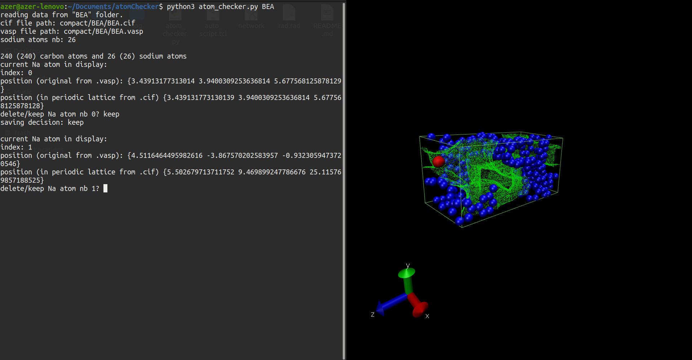

## Atom Checker
This script helps to check whether Na atoms are in an accessible volume inside a Carbon strucutre.

### Important notes
+ To be able to use this script, you need to have the following file structure.
If not, please do move the needed files and folders, otherwise the script won't work correctly.

+ You can alternatively move the content of this repo to the folder where your vmd executable is located. 

+ This is just an automation tool that uses your existing vmd and zeovis executable. Please make sure that they do actually function correctly before using this script.
You can try the following command for testing ```./vmd -e ZeoVis.tcl```, then enter the path of any ```.cif``` file that you wish to visualize.

#### File strucutre
this_folder/

&nbsp;&nbsp;&nbsp;&nbsp;atom_checker.py

&nbsp;&nbsp;&nbsp;&nbsp;template.tcl

&nbsp;&nbsp;&nbsp;&nbsp;vmd

&nbsp;&nbsp;&nbsp;&nbsp;network

&nbsp;&nbsp;&nbsp;&nbsp;rad.rad

&nbsp;&nbsp;&nbsp;&nbsp;ZeoVisCommands.tcl

&nbsp;&nbsp;&nbsp;&nbsp;log/

&nbsp;&nbsp;&nbsp;&nbsp;compact/

&nbsp;&nbsp;&nbsp;&nbsp;&nbsp;&nbsp;&nbsp;&nbsp;BEA/

&nbsp;&nbsp;&nbsp;&nbsp;&nbsp;&nbsp;&nbsp;&nbsp;&nbsp;&nbsp;&nbsp;&nbsp;
BEA_C240Na26.vasp

&nbsp;&nbsp;&nbsp;&nbsp;&nbsp;&nbsp;&nbsp;&nbsp;&nbsp;&nbsp;&nbsp;&nbsp;BEA.cif

&nbsp;&nbsp;&nbsp;&nbsp;&nbsp;&nbsp;&nbsp;&nbsp;&nbsp;&nbsp;&nbsp;&nbsp;BEA.vasp

&nbsp;&nbsp;&nbsp;&nbsp;&nbsp;&nbsp;&nbsp;&nbsp;BEB/

&nbsp;&nbsp;&nbsp;&nbsp;&nbsp;&nbsp;&nbsp;&nbsp;&nbsp;&nbsp;&nbsp;&nbsp;...

&nbsp;&nbsp;&nbsp;&nbsp;&nbsp;&nbsp;&nbsp;&nbsp;...

&nbsp;&nbsp;&nbsp;&nbsp;&nbsp;&nbsp;&nbsp;&nbsp;...

&nbsp;&nbsp;&nbsp;&nbsp;&nbsp;&nbsp;&nbsp;&nbsp;SBT_2

> :warning: **netowrk executable**: The network executable file provided in this repo should be replaced by your own zeo++ network file.

### User guide
* The 'atom_checker.py' script takes the name of a carbon framework as an argument (e.g. BEA) ```python3 atom_checker BEA```
* It naviagtes to the respective .vasp file (e.g. if the framework name is 'BEA' then the .vasp path would be 'compact/BEA/BEA.vasp')
* It reads all the Na and C atoms form the .vasp file
* It saves all the C atoms in a new .cif file
* It iterates through the Na atoms, opens vmd using the generated .cif file, and puts one Na atom at a time in the lattice.
* For every Na atom the user should write either "keep" or "delete" to the console.
* The decision will be saved in the appropriate file under the log folder.
* This process should be done for every carbon framework.
* The "compact" folder contains one .vasp file for every carbon framework with the biggest number of Na atoms. This way we ensure that we the vasp file contains all possible Na atoms that can be found in any other .vasp of the same framework file with less atoms.

### Picture

